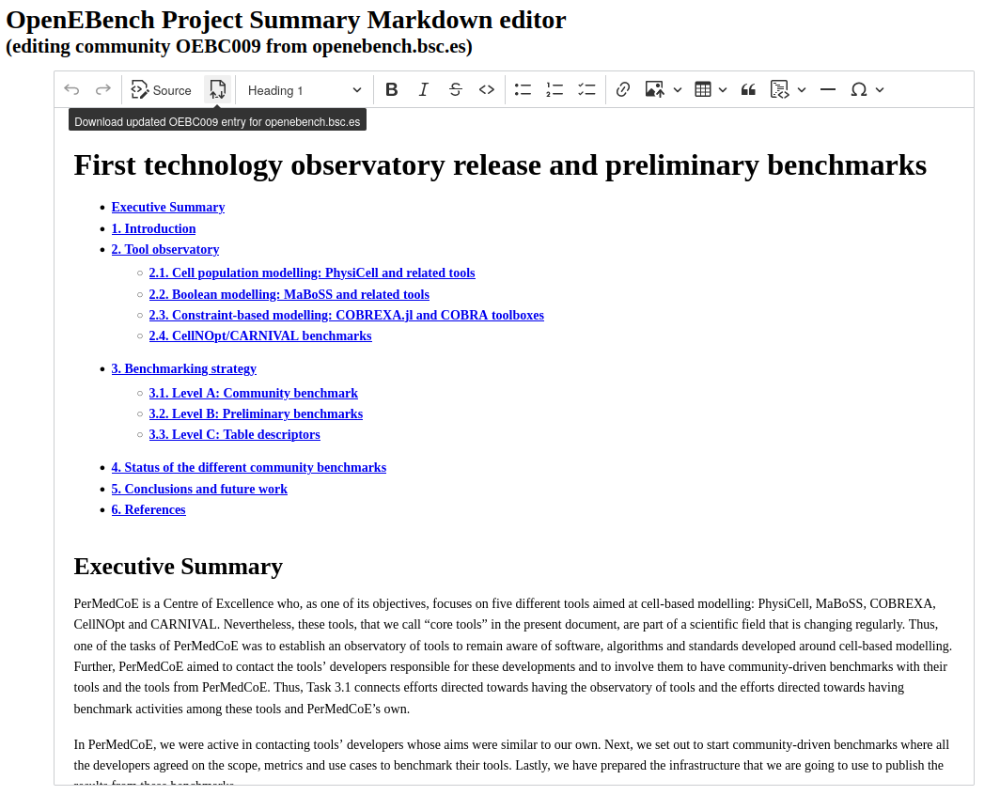

# OpenEBench Project Summary Markdown editor

This proof of concept demonstrates how to edit the summary of an
OpenEBench Scientific community and how to get a copy of the modified entry,
in order to save it later through the [oeb-sci-admin-tools](https://gitlab.bsc.es/inb/elixir/openebench/oeb-sci-admin-tools).

# Usage

The demonstration URL is https://inab.github.io/oeb-project-markdown-editor/ .

As you can see in examples written below, the URL of the editor accepts
query parameters `community_id` and `dev` to
tell the community description to edit and whether to do it in the
production or the development OpenEBench server.



This Markdown editor is almost 100% compatible with GitHub one. It can have some issues with inline links.

Images can be either linked or embedded. In this last case, they will be encoded in a data URI.

Use the Source button to edit and paste raw Markdown.

When you have finished, use the Download button to locally save a JSON file with the updated entry.

# Examples

## Edit a production community

<https://inab.github.io/oeb-project-markdown-editor/?community_id=OEBC009>

## Edit a development community

<https://inab.github.io/oeb-project-markdown-editor/?community_id=OEBC012&dev=true>


# Development Installation

## Installation steps

1. Clone this repository:

```shell
git clone https://github.com/inab/oeb-project-markdown-editor.git
```

2. Change the directory and install the dependencies:

```shell
cd oeb-project-markdown-editor
npm ci
```

3. Start the development server:

```shell
npm run start
```

# Credits
This editor is based on CKEditor5 example of Markdown plugin usage from `ckeditor/ckeditor5-demos.git`.

The Markdown plugin enables the editor to support both Markdown input and output.
